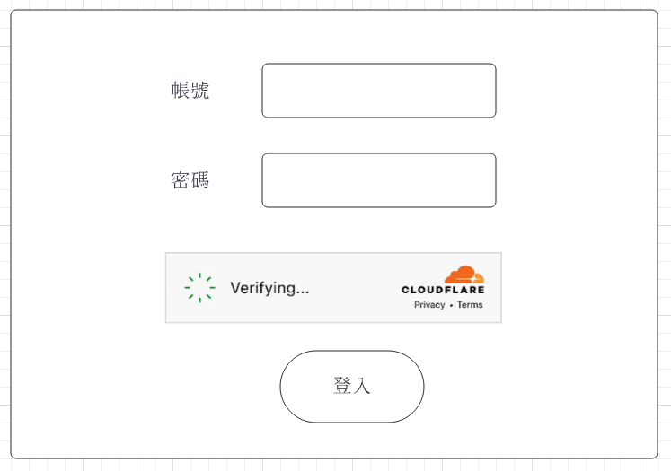
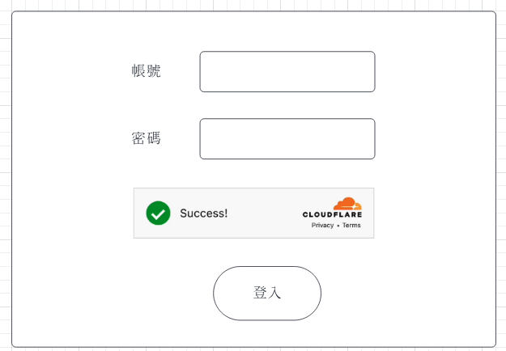

# Vue_Cloudflare_Turnstile

## 內容
- [IDE](#ide)
- [Sample Code](#sample-code)
- [Backend](#backend)
- [Frontend](#frontend)
- [需求](#%E9%9C%80%E6%B1%82)

## IDE
* https://code.visualstudio.com/

## Sample Code
* https://github.com/ArcherHuang/Vue_Cloudflare_Turnstile

## Backend
* 1. 安裝 Node v18.17.0
* 2. cd Vue_Cloudflare_Turnstile/API
* 3. node index.js 
* 4. API
  * URI
    * POST http://localhost:3000/signin
  * Body
    ```json
    {
       "username": "user01",
       "password": "qwer1681"
    }
    ```

## Frontend
* 1. 安裝 Vue 3
* 2. cd Vue_Cloudflare_Turnstile/Dashboard
* 3. 請製作此 Wireframe 的畫面並串接 signin API
  
* 4. npm run serve

## 需求
* Backend 端在 Sample Code 中已經判斷 username 與 password 等資訊，請前後端額外再加上透過 Cloudflare Turnstile 的判斷條件，也就是說這三個條件都判斷成功才算是登入成功。

* Frontend 端 Wireframe


